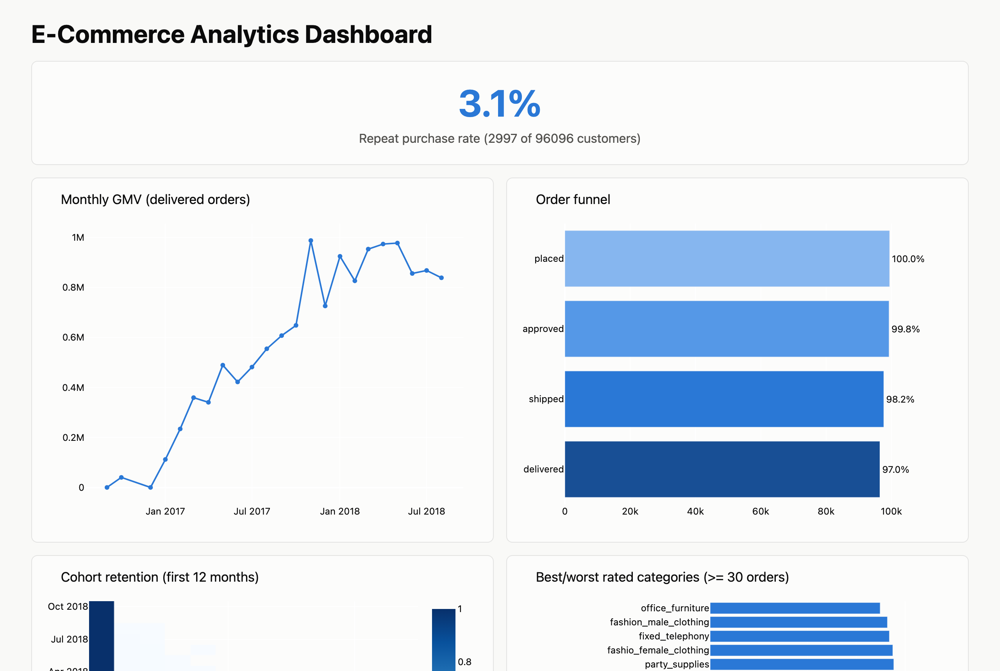

# E-Commerce Analytics Case Study

An end-to-end analytics case study on the [Olist Brazilian E-Commerce dataset](https://www.kaggle.com/datasets/olistbr/brazilian-ecommerce):
ingestion, warehouse modeling, business KPIs, causal/experiment analysis,
a live dashboard, and a written case study.

- **[Live dashboard](https://rustin-khaz.github.io/ecommerce-analytics-case-study/dashboard/)**
- **[Case study write-up](docs/case_study.md)**

[](https://rustin-khaz.github.io/ecommerce-analytics-case-study/dashboard/)

## Key findings

- **Late deliveries cost 1.7 stars.** Late orders average 2.57 stars against 4.22 for on-time ones, and controlling for order size, freight and state barely narrows the gap.
- **Almost nobody comes back.** 3.1% of 96,096 customers ordered twice, so the first order decides the relationship.
- **Revenue is concentrated.** São Paulo brings in R$5.07M of R$13.2M total GMV, close to three times Rio de Janeiro.
- **Orders get lost in fulfillment, not checkout.** 99.8% of orders get approved and 97.0% get delivered.

The [write-up](docs/case_study.md) covers the method, the quasi-experiment's limits and the recommendations.

## Architecture

```
Kaggle CSVs → Python ingestion script → DuckDB (raw schema)
                                            │
                                    dbt-core models
                                            │
                        staging (cleaned, typed, deduped)
                                            │
                mart layer: dim_customers, dim_products, fct_orders,
                fct_order_items, fct_payments, fct_reviews
                                            │
        ┌───────────────┬──────────────────┴───────────────┐
   SQL KPI views    Python EDA/stats notebooks         Plotly dashboard
  (GMV, AOV, repeat   (EDA, quasi-experiment,          (published via
   rate, cohort         synthetic RCT module)          GitHub Pages)
   retention, funnel)
```

## Repo Structure

```
/ingestion      Kaggle download script + DuckDB raw loader (data itself is gitignored)
/warehouse      dbt project (staging + marts + KPI views)
/notebooks      EDA, quasi-experiment, synthetic RCT
/dashboard      Plotly dashboard build script + generated HTML (live via GitHub Pages)
/tableau        Order-level CSV export for the Tableau Public dashboard
/docs           case study write-up
```

## Setup

```bash
python3 -m venv .venv
source .venv/bin/activate
pip install -r requirements.txt

# Download the dataset and load it into the DuckDB warehouse
python3 ingestion/download_data.py
python3 ingestion/load_raw.py

# Build the dbt staging/mart/KPI layers
dbt run --project-dir warehouse --profiles-dir warehouse
dbt test --project-dir warehouse --profiles-dir warehouse

# Rebuild the dashboard from the current warehouse
python3 dashboard/build_dashboard.py

# Run the notebooks (EDA, quasi-experiment, synthetic RCT)
jupyter notebook notebooks/
```

Run `pytest` to check the ingestion test suite (dataset download, raw loader).
